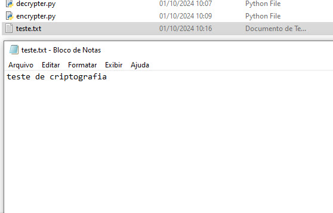
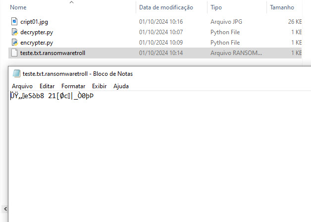

# Trabalho prático de criação de um Ransomware
## Ferramentas Utilizadas

- Windows 10 e python

Neste trabalho do curso DIO de Formação Cybersecurity Specialist o objetivo é criptografar um arquivo usando uma chave
e depois descriptar usando a mesma chave.

## Antes da criptgrafia

## Depois da criptgrafia

